<p align="center">
  
</p>

<h1 align="center">Prova</h1>
<h3 align="center">Private, compliant cross-border remittance on Stellar.</h3>
<p align="center"><em>A transfer is accepted because it can be <b>proven</b> legal — not because someone saw it.</em></p>

<p align="center">
  
  
  
  
  
  
</p>

<p align="center">
  <a href="#the-problem">The problem</a> ·
  <a href="#the-solution">The solution</a> ·
  <a href="#who-this-is-for">Who it's for</a> ·
  <a href="#key-features">Features</a> ·
  <a href="#smart-contracts">Contracts</a> ·
  <a href="#technology-stack">Stack</a> ·
  <a href="#architecture">Architecture</a> ·
  <a href="#getting-started">Getting started</a> ·
  <a href="#documentation-map">Docs</a>
</p>

<p align="center">
  <a href="https://expo.dev/artifacts/eas/oAnuYNhjY-gr636BxvyngC_PMGn6MzBFHKH9Uok5k88.apk">
    
  </a>
</p>

<p align="center">
  <sub>Android 8+ · <b>arm64</b> · Stellar <b>testnet</b> — balances are test assets with no monetary value</sub>
</p>

---

## Download the app

<table>
  <tr>
    <td align="center" width="150">
      
      <br><br>
      <a href="https://expo.dev/artifacts/eas/oAnuYNhjY-gr636BxvyngC_PMGn6MzBFHKH9Uok5k88.apk">
        
      </a>
    </td>
    <td>
      <table>
        <tr><td><b>Version</b></td><td>1.2.5 · 86 MB</td></tr>
        <tr><td><b>Requires</b></td><td>Android 8+, <b>arm64</b> device</td></tr>
        <tr><td><b>Network</b></td><td>Stellar testnet</td></tr>
        <tr><td><b>Website</b></td><td><a href="https://provapay.duckdns.org">provapay.duckdns.org</a></td></tr>
      </table>
    </td>
  </tr>
</table>

Android will ask you to allow installing from outside the Play Store. Prova is not on the Play Store
yet — a payments app has to clear their financial-services review first.

**arm64 only, deliberately.** The zero-knowledge prover that builds every spend proof is a native
Rust library with no 32-bit build, so a `armeabi-v7a` device would install the app, run it, and then
fail at the exact moment it tried to send. Shipping one architecture makes that impossible rather
than surprising. Every phone from roughly 2015 onward is arm64.

> Balances are testnet assets with **no monetary value**, and the test network can be reset at any
> time. Try it freely; do not treat anything in it as savings.

---

## Trying it

Two phones, since a transfer needs someone to receive it. Everything runs on Stellar **testnet** —
the balances are test assets with no monetary value.

1. **Install** the app and allow installing from outside the Play Store.
2. **Sign in** with your email. A 6-digit code arrives by email, then you choose a PIN.
3. **Verify your identity** — your name, your phone, a photo of your ID and a selfie. It goes to a
   reviewer, who approves it at [/ops](https://provapay.duckdns.org/ops). No vendor is connected
   yet, so this step is manual.
4. **Add money** — free testnet funds, then "Make it private" to move them into the shielded pool.
5. **Add the person you are sending to** — scan their QR from Profile → Account details → Receive
   privately, or paste the address they send you.
6. **Send.** It appears in Activity on both phones.

A step-by-step version for people who are not developers lives on
[provapay.duckdns.org](https://provapay.duckdns.org/#get-the-app).

---

## Table of contents

- [Download the app](#download-the-app)
- [Trying it](#trying-it)
- [Submission](#submission)
- [Screenshots](#screenshots)
- [User feedback](#user-feedback)
- [On-chain activity](#on-chain-activity)
- [Overview](#overview)
- [The problem](#the-problem)
- [The solution](#the-solution)
- [Who this is for](#who-this-is-for)
- [Key features](#key-features)
- [Smart contracts](#smart-contracts)
- [Technology stack](#technology-stack)
- [Architecture](#architecture)
- [How a transfer actually works](#how-a-transfer-actually-works)
- [Testing](#testing)
- [Repository layout](#repository-layout)
- [Prerequisites](#prerequisites)
- [Getting started](#getting-started)
- [Environment configuration](#environment-configuration)
- [Security & privacy model](#security--privacy-model)
- [Troubleshooting](#troubleshooting)
- [Documentation map](#documentation-map)
- [CI](#ci)
- [Roadmap](#roadmap)

---

## Submission

Everything a reviewer needs, in one place. Every link below was checked live at the time of writing.

| Item                    | Link                                                                                                                                                                           |
| ----------------------- | ------------------------------------------------------------------------------------------------------------------------------------------------------------------------------ |
| **Live demo (website)** | [provapay.duckdns.org](https://provapay.duckdns.org)                                                                                                                           |
| **Demo video**          | [Watch the full walkthrough ↗](https://drive.google.com/file/d/1oq--g0CN8wtDmr8hj-Hdj38XWqBHMGI9/view?usp=sharing)                                                             |
| **Android APK**         | [Download v1.2.5 · 86 MB ↗](https://expo.dev/artifacts/eas/oAnuYNhjY-gr636BxvyngC_PMGn6MzBFHKH9Uok5k88.apk)                                                                    |
| **Operations console**  | [provapay.duckdns.org/ops](https://provapay.duckdns.org/ops)                                                                                                                   |
| **API health**          | [`/healthz`](https://provapayment.duckdns.org/healthz) · [`/readyz`](https://provapayment.duckdns.org/readyz) · [`/pool/status`](https://provapayment.duckdns.org/pool/status) |
| **Pool contract**       | [`CBLLKIUUWPH4GCPL4NNK6S6NGDG4OEAX33TTYJ7RPO3SZU52FHYYJEVX`](https://stellar.expert/explorer/testnet/contract/CBLLKIUUWPH4GCPL4NNK6S6NGDG4OEAX33TTYJ7RPO3SZU52FHYYJEVX)        |
| **Verifier contract**   | [`CBQ2HVIYASMYNRIKWM54JUA3A4OGQOWRP42BLMRRB262YQINAA36GD5U`](https://stellar.expert/explorer/testnet/contract/CBQ2HVIYASMYNRIKWM54JUA3A4OGQOWRP42BLMRRB262YQINAA36GD5U)        |
| **Feedback form**       | [Submit feedback ↗](https://forms.gle/DVGDyJiRxeQ5QxuG7)                                                                                                                       |
| **Feedback responses**  | [Response sheet ↗](https://docs.google.com/spreadsheets/d/16Rxrb8Tt8Va-EvP4jV3ayRW_0iJd23LAEmRPc3WthGs/edit?usp=sharing)                                                       |

### Requirements

| Requirement                             | Status        | Where                                                                              |
| --------------------------------------- | ------------- | ---------------------------------------------------------------------------------- |
| Production-ready MVP                    | Done          | Deployed end-to-end; a private transfer settles on testnet today                   |
| Stable frontend + contract architecture | Done          | [Architecture](#architecture) · [Smart contracts](#smart-contracts)                |
| Mobile responsive UI                    | Done          | [Screenshots](#screenshots) — native Android app; the marketing site is responsive |
| Loading states + error handling         | Done          | [Payment states](#payment-states-loading-and-error-handling)                       |
| Production deployment                   | Done          | App, API, website and both contracts are live                                      |
| Monitoring / analytics                  | Done          | [Monitoring](#monitoring-and-operations)                                           |
| Project structure + documentation       | Done          | [Repository layout](#repository-layout) · [Documentation map](#documentation-map)  |
| Contracts on Stellar testnet            | Done          | Both contract IDs above, verifiable on Stellar Expert                              |
| 15+ meaningful commits                  | Done — **78** | `git rev-list --count HEAD`                                                        |
| Public GitHub repository                | Done          | [github.com/soumen0818/Prova](https://github.com/soumen0818/Prova)                 |
| User feedback collection                | Done          | [User feedback](#user-feedback)                                                    |
| Proof of wallet interactions            | Partial       | [On-chain activity](#on-chain-activity) — see the note there                       |

---

## Screenshots

Every screen below is the real app running against Stellar testnet.

### Product UI

<table>
  <tr>
    <td align="center">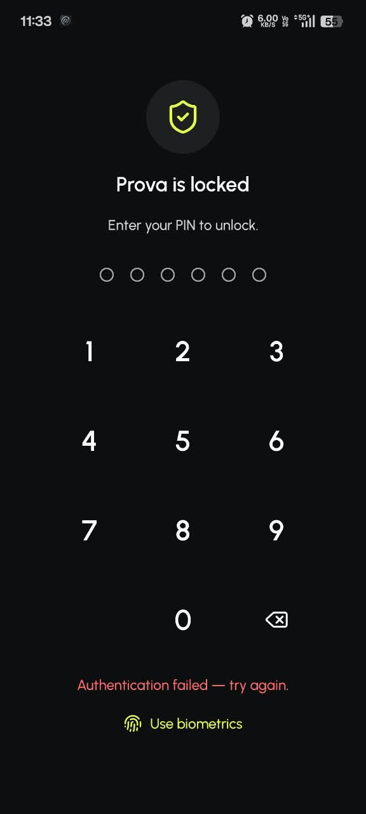<br><sub><b>Unlock</b> — PIN or fingerprint</sub></td>
    <td align="center">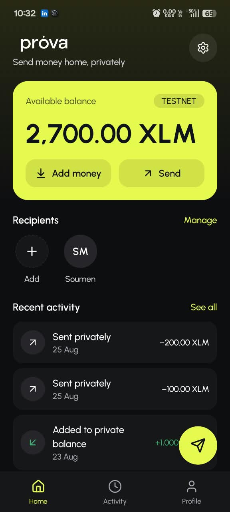<br><sub><b>Home</b> — balance and activity</sub></td>
    <td align="center">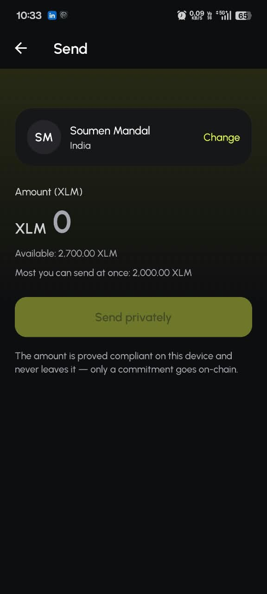<br><sub><b>Send</b> — amount entry</sub></td>
    <td align="center">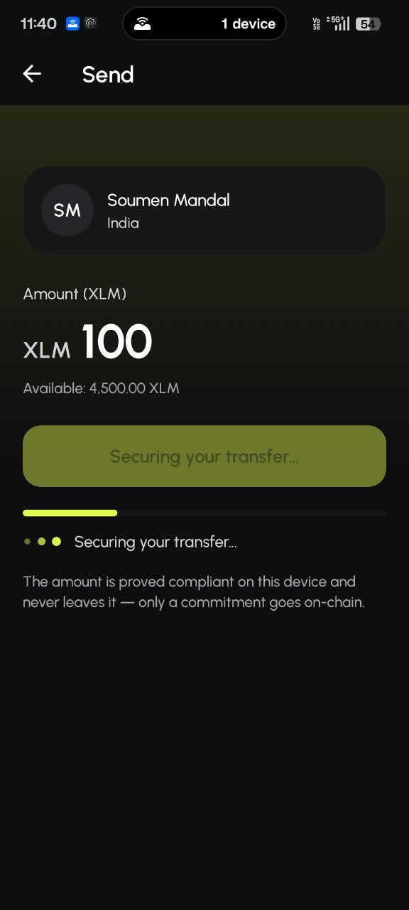<br><sub><b>Proving</b> — on-device ZK proof</sub></td>
  </tr>
  <tr>
    <td align="center">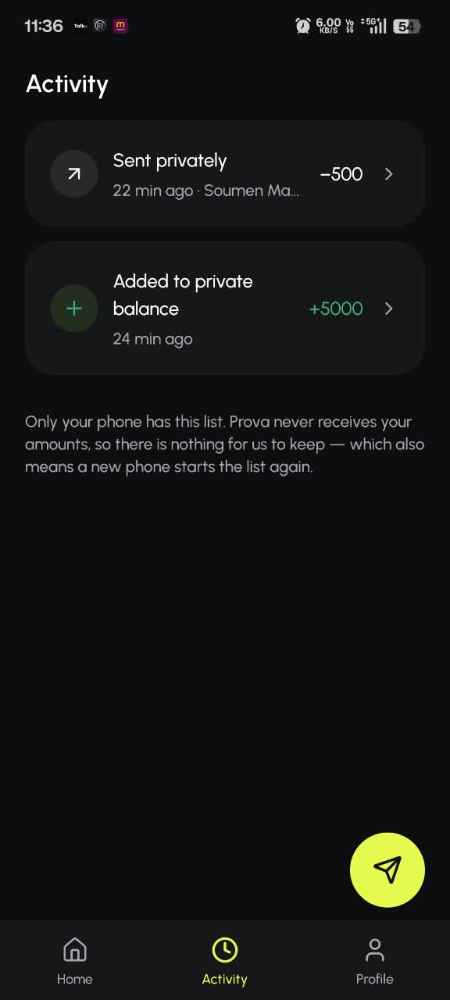<br><sub><b>Activity</b> — local history</sub></td>
    <td align="center">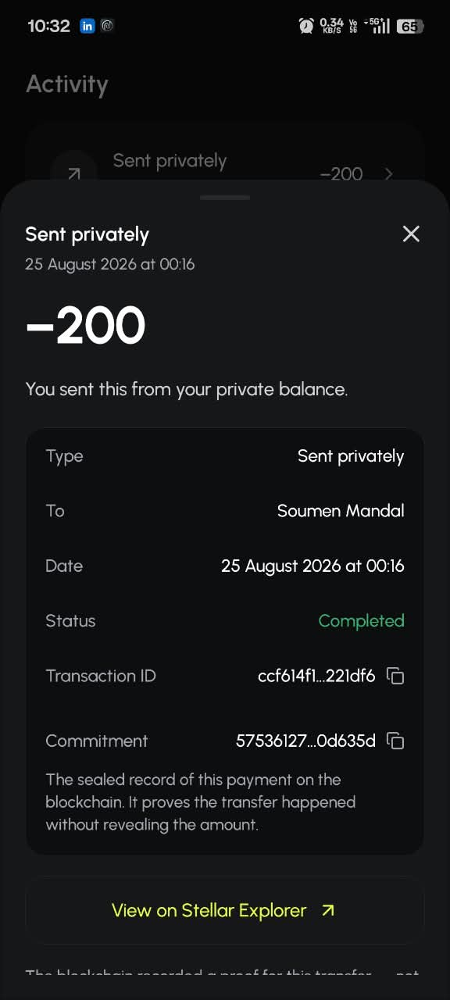<br><sub><b>Transaction detail</b></sub></td>
    <td align="center">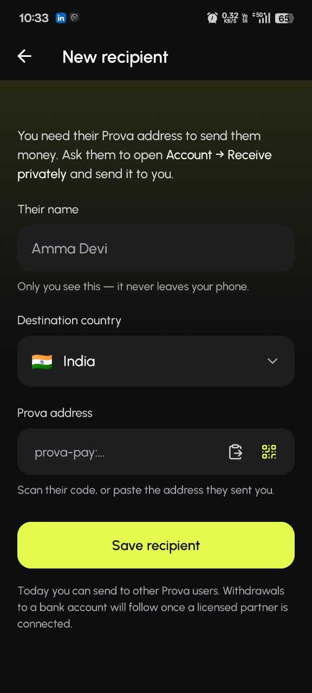<br><sub><b>Add recipient</b> — QR or paste</sub></td>
    <td align="center">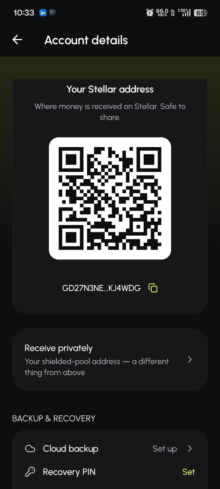<br><sub><b>Receive</b> — address and QR</sub></td>
  </tr>
  <tr>
    <td align="center">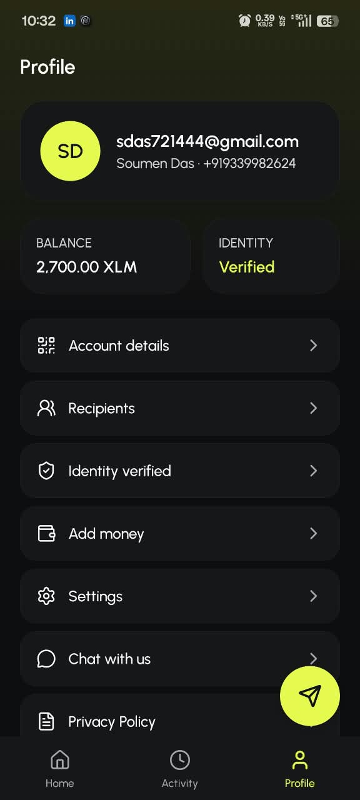<br><sub><b>Profile</b></sub></td>
    <td align="center">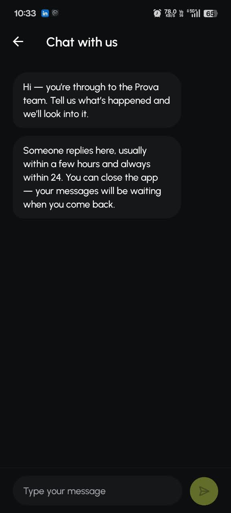<br><sub><b>Support</b> — in-app messages</sub></td>
    <td align="center"><br><sub><b>Launch</b></sub></td>
    <td></td>
  </tr>
</table>

### Payment states (loading and error handling)

Three outcomes, three different things to say. The rule throughout: never imply money moved when it
did not, and never imply it is lost when it might still land.

<table>
  <tr>
    <td align="center">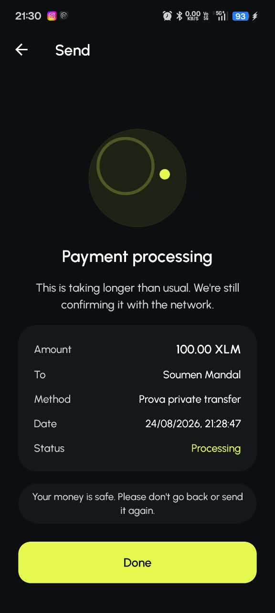<br><sub><b>Processing</b><br>Outcome unknown — the screen says the money is safe and explicitly tells the user <i>not</i> to send again, because a duplicate payment is the expensive mistake here.</sub></td>
    <td align="center">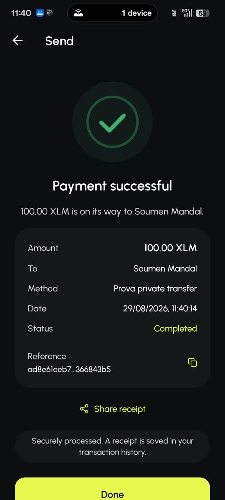<br><sub><b>Successful</b><br>Confirmed on-chain, with a reference that can be checked independently on Stellar Expert.</sub></td>
    <td align="center">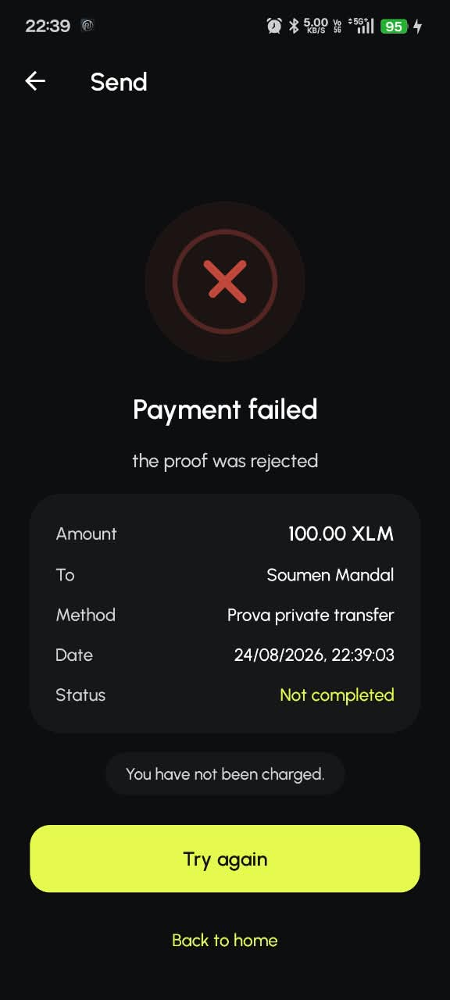<br><sub><b>Failed</b><br>States plainly that nothing was charged, and offers a retry rather than leaving the user guessing.</sub></td>
  </tr>
</table>

### Website (responsive)

<table>
  <tr>
    <td align="center">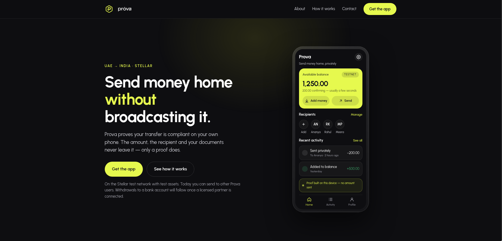<br><sub><b>Landing page</b> — provapay.duckdns.org</sub></td>
    <td align="center">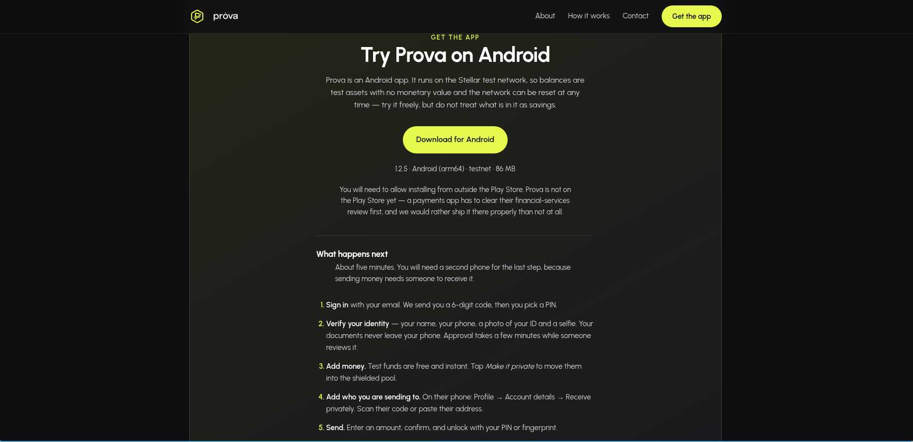<br><sub><b>Get the app</b> — download and onboarding steps</sub></td>
  </tr>
</table>

### Monitoring and operations

<p align="center">
  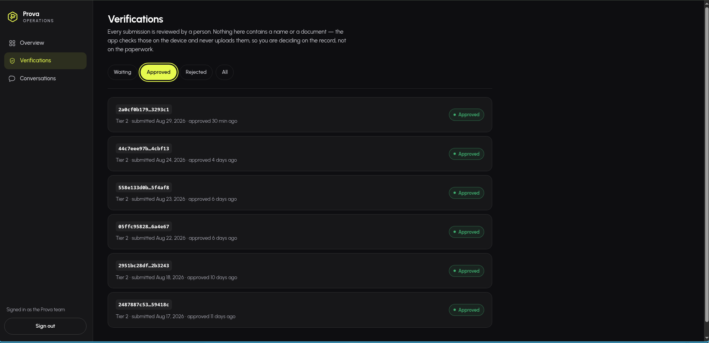
</p>

The operations console at [`/ops`](https://provapay.duckdns.org/ops) is where verifications are
reviewed and support conversations are answered. It shows queue state, per-submission status and
approval timestamps.

Note what is _not_ on that screen: no name, no document, no amount. The app checks identity documents
on the device and never uploads them, so a reviewer decides on the record rather than on the
paperwork — and an operator with full console access still cannot see what anyone is worth or who
they paid. The API also exposes
[`/healthz`](https://provapayment.duckdns.org/healthz),
[`/readyz`](https://provapayment.duckdns.org/readyz) and
[`/pool/status`](https://provapayment.duckdns.org/pool/status), the last of which reports tree size,
queue depth and the most recent fold — queue depth being the number to alert on, since a rising queue
means new notes are not becoming spendable.

---

## User feedback

Collected through a public [feedback form](https://forms.gle/DVGDyJiRxeQ5QxuG7); raw responses live
in the [response sheet](https://docs.google.com/spreadsheets/d/16Rxrb8Tt8Va-EvP4jV3ayRW_0iJd23LAEmRPc3WthGs/edit?usp=sharing).

### Responses and what changed

| #   | Date        | Tester        | Overall    | Reported                                                                                   | Action taken                                                                                                                                                                                                                                                                    | Status     | Commit                                                                                           |
| --- | ----------- | ------------- | ---------- | ------------------------------------------------------------------------------------------ | ------------------------------------------------------------------------------------------------------------------------------------------------------------------------------------------------------------------------------------------------------------------------------- | ---------- | ------------------------------------------------------------------------------------------------ |
| 1   | 22 Aug 2026 | Souvik Mandal | **9 / 10** | No bug. Feature request: _"If possible then please make the pull [pool] address concise."_ | Receive address re-encoded — raw bytes with a CRC-32 checksum instead of base64'd JSON, cutting it from **302 to 145 characters**. A checksum was added at the same time so a truncated paste is now _rejected_ rather than silently becoming a different, unowned destination. | ✅ Shipped | [`996f391`](https://github.com/soumen0818/Prova/commit/996f3911c457c76e0833f4b84813731652468a23) |

Reported 22 Aug 23:02; fixed and committed 23 Aug 00:45 — one hour and forty-three minutes later.

### Ratings

| Aspect                      | Rating          |
| --------------------------- | --------------- |
| Overall satisfaction        | 9 / 10          |
| Ease of navigation / UI     | Excellent (4/4) |
| Speed and performance       | Excellent (4/4) |
| Reliability of transactions | Excellent (4/4) |
| Security features           | Good (3/4)      |
| Customer support            | Good (3/4)      |

Tester email addresses are collected by the form for follow-up and are deliberately **not** reproduced
here — publishing a tester's contact details in a public repository would be a poor trade for a
product whose entire argument is that it does not leak what it does not need.

---

## On-chain activity

Private transfers relayed through the pool contract on Stellar testnet. Each hash is independently
verifiable — the contract, the ledger and the result are all public.

| #   | Transaction                                                                                                                      | Date                  | Result                      |
| --- | -------------------------------------------------------------------------------------------------------------------------------- | --------------------- | --------------------------- |
| 1   | [`328e56e8…3bf21c`](https://stellar.expert/explorer/testnet/tx/328e56e895cb21ede13bda7e0a349872e8028f4107034cb7cdf1ce59643bf21c) | 29 Aug 2026 05:44 UTC | ✅ Success · ledger 4391734 |
| 2   | [`ad8e61ee…6843b5`](https://stellar.expert/explorer/testnet/tx/ad8e61eeb75f3f88917898acb3ddedb9c196b1be49b91a3d95d93cd9366843b5) | 29 Aug 2026 06:10 UTC | ✅ Success · ledger 4392045 |

Both are `invoke_host_function` calls against the pool contract `CBLLKIUU…`, submitted by the relayer.

**Why every transfer comes from one account, on purpose.** The proof already hides the amount and the
parties — but somebody has to pay the fee and sign the submission, and if that were the sender's own
Stellar account the chain would record "this account spent" next to the nullifier and the privacy
would be gone in practice. So the backend relays instead, and every transfer arrives from the same
account. What an observer learns is "Prova relayed a transfer", which is true of every transfer. The
relayer cannot steal or redirect anything: the amount, both output notes, the payout destination and
the encrypted payloads are all bound inside the proof. Its only powers are to refuse, and to see that
a proof passed through it.

> **On the 10-user requirement.** Onboarding is real and independently visible — the operations
> console screenshot above shows **six approved Tier-2 verifications** spanning 17–29 Aug 2026, each
> one a person who installed the app, submitted identity documents and was reviewed. What this table
> does not yet do is enumerate ten _distinct_ wallet interactions, because a private transfer is
> deliberately unlinkable: the chain shows a nullifier and two commitments, never a sender. Additional
> transaction hashes are being added here as testers complete transfers.

---

## Overview

**Prova** — from _"proof."_ The name is the product: a transfer is accepted because it can be
**proven** legal, not because a bank, a forex desk, and three correspondent banks all got to look at
the amount and the identity behind it.

> **The mental model:** a sealed letter with a notary stamp. The post office never opens the letter
> to know it's valid — it trusts the stamp. Here, the notary is math, it runs on the sender's phone,
> and the stamp carries zero personal information.

- **First corridor:** UAE → India.
- **Rails:** Stellar — it already solved speed, cost, and fiat on/off-ramps (anchors + SEPs). Prova
  adds the one layer that was missing: **privacy in transit, with compliance intact.**
- **Status:** deployed and verified end-to-end on **Stellar testnet** — see
  [Smart contracts](#smart-contracts) for live contract IDs you can check yourself.
- **Scope today:** transfers run Prova-to-Prova. Withdrawals to a bank account will follow once a
  licensed payout partner is connected — the private transfer is built; the last mile is a
  commercial arrangement, not a missing feature.

## The problem

Meet Ravi. He works in Dubai; his mother lives in West Bengal. Every month he sends her ₹15,000 —
groceries, medicine, the electricity bill. Millions of people do exactly this.

Here's what happens to that ₹15,000 today:

```
Ravi → UAE bank/exchange → SWIFT correspondent bank → forex desk → Indian bank → Amma
         (sees amount)        (sees amount)             (sees amount)  (sees amount)
```

**Five different companies read his exact amount.** He loses 5–7% to fees. It takes 2–5 days. And
there's nothing he can do about it — that's simply how the system works. This isn't a UX
inconvenience, it's structural:

- **No privacy** — salary, family budget, spending patterns: all visible to every intermediary, and
  sellable as data.
- **Cost** — every intermediary takes a cut. The ~$800B/year global remittance market loses tens of
  billions of dollars to the middle.
- **Latency** — correspondent banking settles in days, not seconds.

Crypto solved cost and speed years ago. So why hasn't this been fixed for Ravi? Because of the
deeper problem: **privacy and compliance are mathematical opposites**, and nobody has made them work
together on a live payment corridor at consumer scale. Every existing payment system is a
transparent pipe — every node sees everything, _because seeing is how it verifies_. To check "does
Ravi have enough money," the system reads his balance. To check "is this legal," it reads the
amount. To check "is he KYC'd," it reads his identity. **You cannot verify something you cannot
see** — that single constraint is what makes privacy and compliance enemies in every system that
exists today.

## The solution

The amount stays **private** while it travels, but a **mathematical proof travels alongside it**
that says _"trust me, this is legitimate"_ — and anyone can verify that proof **without ever
learning the actual number**. That's what zero-knowledge means: proving a statement is true without
revealing the secret behind it.

Concretely: when Ravi sends ₹15,000, his phone generates a proof that simultaneously asserts
**(a)** the amount is within the legal limit, **(b)** he holds a valid KYC credential from a
licensed anchor, and **(c)** this exact transfer/note has never been spent before. A Soroban smart
contract on Stellar verifies that proof in milliseconds and accepts or rejects it. If accepted, only
a **commitment hash** and a **nullifier** are written on-chain. The number ₹15,000 appears nowhere.

> ZK is to Stellar's payment rails what **HTTPS is to the internet.** The internet could already move
> data; HTTPS added a privacy/security layer on top without replacing the pipes. Prova adds a
> privacy layer on top of Stellar's existing payment pipes — it doesn't replace them.

The regulator doesn't actually need to _see_ the amount — they need to _verify three facts_ (in
range, KYC'd, not replayed), and a Groth16 proof verifies exactly those three facts and nothing
else. That's the whole trick, and it's why privacy and compliance stop being enemies.

## Who this is for

| Role                                                       | What they get                                                                                                                                               | Where in the system                                |
| ---------------------------------------------------------- | ----------------------------------------------------------------------------------------------------------------------------------------------------------- | -------------------------------------------------- |
| **Sender** (e.g. Ravi)                                     | A wallet that generates its own keys on-device, verifies identity once, and sends privately — the amount never leaves the phone in the clear.               | `mobile/`                                          |
| **Recipient** (e.g. Amma)                                  | Cash-out through a licensed local anchor, same privacy guarantees on the sending leg.                                                                       | `mobile/` + anchor rails                           |
| **Licensed anchors** (UAE deposit-side, India payout-side) | Existing SEP-1/6/10/12/24/31 infrastructure they already run for other Stellar products — Prova adds a privacy layer, not a new integration model.          | `backend/internal/anchor/`, `Docs/deposit-flow.md` |
| **Pool operator** (the folder)                             | A permissionless, low-trust role: batches queued notes into the Merkle tree. Can stall the queue, can never mint, steal, or spend.                          | `backend/internal/pool/folder.go`                  |
| **Auditor / regulator**                                    | Every accepted transfer emits an on-chain event and every KYC decision is written to an append-only audit log — provable compliance without a data request. | `Docs/kyc-verification.md`                         |

## Key features

**Privacy**

- On-device proof generation — the amount never leaves the phone in the clear, not even to Prova's
  own backend.
- Shielded-pool note model: on-chain, an observer sees only commitments, nullifiers, and proofs —
  never balances, never amounts, never who paid whom.
- Encrypted note discovery — incoming payments are findable only by their owner (Jubjub ECDH +
  Poseidon-derived masking), not by anyone watching the chain.

**Compliance, without the surveillance**

- KYC once: an anchor-signed credential, verified _inside_ the ZK proof, proves "verified, unexpired,
  sufficient tier" without ever putting a passport number or a name on-chain.
- Every accepted transfer is an on-chain event; every KYC decision is an append-only audit record —
  auditable without being surveillable.

**Wallet & security**

- One master seed, generated on-device, stored only in the platform secure enclave (iOS Keychain /
  Android Keystore) — never uploaded anywhere in the clear.
- PIN + biometric step-up for every money-moving action.
- Encrypted cloud backup (iCloud / Google Drive) via envelope encryption — a lost phone doesn't mean
  a lost wallet.
- Real, rate-limited, hashed email one-time codes for sign-in (no dev-only shortcuts in production).

**Speed & cost**

- Stellar settlement: seconds, not days.
- A folded batch of up to 8 notes updates the entire pool's Merkle root in one on-chain transaction.

## Smart contracts

Two Soroban (Rust) contracts, both live and verified on **Stellar testnet** today.

### `prova-pool` — the shielded pool (real token custody)

> **Contract ID:** `CBLLKIUUWPH4GCPL4NNK6S6NGDG4OEAX33TTYJ7RPO3SZU52FHYYJEVX`
> **Network:** Stellar Testnet · **Explorer:** [view on Stellar Expert ↗](https://stellar.expert/explorer/testnet/contract/CBLLKIUUWPH4GCPL4NNK6S6NGDG4OEAX33TTYJ7RPO3SZU52FHYYJEVX)

Custodies real tokens and moves value privately between notes. Verified on-chain: `admin` matches
the deployed admin key, `root` matches the circuit's independently-computed empty-tree root,
`is_paused` is `false`, `queue_depth` is `0`. Full deployment record, transaction hashes, and the
anchor-key rotation history: [`contracts/DEPLOYMENTS.md`](contracts/DEPLOYMENTS.md).

| Function                                                                     | Access         | Description                                                                                                                       |
| ---------------------------------------------------------------------------- | -------------- | --------------------------------------------------------------------------------------------------------------------------------- |
| `initialize(admin, token, anchor_pk_x, anchor_pk_y)`                         | one-time       | Binds the pool to its custodied token and trusted KYC anchor                                                                      |
| `shield(from, amount, note, proof)`                                          | public         | Move real tokens in, queue the resulting note                                                                                     |
| `transact(proof, nullifier, merkle_root, outputs, current_time)`             | public         | Private transfer — 1 note in, 2 notes out, nothing revealed but a nullifier and two commitments                                   |
| `unshield(proof, nullifier, merkle_root, outputs, amount, to, current_time)` | public         | Withdraw real tokens to a public Stellar address — same circuit as `transact`, so on-chain shape never reveals which one happened |
| `update_root(proof, new_root, count)`                                        | permissionless | Folds queued notes into the tree — the contract itself never hashes (see why below)                                               |
| `set_paused(paused)`                                                         | admin          | Halts deposits/transfers; **withdrawals are never paused**                                                                        |
| `set_anchor`, `set_admin`, `upgrade`                                         | admin          | Break-glass operations — see `Docs/deployment-and-keys.md` §6                                                                     |
| `root()`, `queue_depth()`, `is_spent(nullifier)`, `is_known_root(root)`      | read-only      | State queries — `queue_depth` is the number to watch operationally                                                                |

**Why the pool never hashes on-chain:** a measured Poseidon permutation costs ~10.97M CPU
instructions against Soroban's 100M-per-transaction budget — a depth-20 Merkle append needs 20 of
them and simply cannot fit. So tree maintenance is deferred and batched: `shield`/`transact`/
`unshield` only ever verify a proof and queue a commitment; a **permissionless** off-chain folder
periodically proves a batch tree-append and calls `update_root`. The fold proof enforces
correctness, so a folder can neither mint nor steal — only stall.

### `prova-verifier` — per-transfer proof verifier (circuit v2)

> **Contract ID:** `CBQ2HVIYASMYNRIKWM54JUA3A4OGQOWRP42BLMRRB262YQINAA36GD5U`
> **Network:** Stellar Testnet · **Explorer:** [view on Stellar Expert ↗](https://stellar.expert/explorer/testnet/contract/CBQ2HVIYASMYNRIKWM54JUA3A4OGQOWRP42BLMRRB262YQINAA36GD5U)

The earlier design: verifies a KYC-inclusive Groth16 proof (range + commitment + nullifier +
in-circuit anchor signature) without custodying any tokens itself. Verified live on testnet:
`verify` → `true`, `submit` → success + `transfer` event, ~49.0M CPU per verification.

| Function                                                                                           | Access    | Description                                                                     |
| -------------------------------------------------------------------------------------------------- | --------- | ------------------------------------------------------------------------------- |
| `verify(proof_a, proof_b, proof_c, commitment, nullifier, anchor_pk_x, anchor_pk_y, current_time)` | public    | Pure Groth16 check — no state change                                            |
| `submit(...)`                                                                                      | public    | Verifies, rejects an already-used nullifier, records + emits a `transfer` event |
| `is_spent(nullifier)`, `is_committed(commitment)`                                                  | read-only | State queries                                                                   |

Both contracts verify **BLS12-381** Groth16 proofs using Soroban's native `pairing_check` host
function, against a verifying key embedded at compile time — never computed on-chain, always
generated by the `prova-prover` CLI in `circuits/`. Full contract-level detail, types, and the
security model behind every entrypoint: [`contracts/README.md`](contracts/README.md).

## Technology stack

| Layer                         | Technology                                                         | Why                                                                                                                                                 |
| ----------------------------- | ------------------------------------------------------------------ | --------------------------------------------------------------------------------------------------------------------------------------------------- |
| **Mobile app**                | React Native + Expo SDK 56, TypeScript, expo-router                | One codebase; native module support for the on-device prover and the platform secure enclave                                                        |
| **State / data**              | TanStack Query                                                     | The sole state/data-fetching library — no Redux/Zustand                                                                                             |
| **On-device crypto (JS)**     | `@noble/curves`, `@noble/hashes`, `@noble/ciphers`, `@scure/base`  | Audited pure-JS primitives for everything that isn't Groth16/Poseidon/Jubjub                                                                        |
| **On-device crypto (native)** | Rust, `ark-groth16`, `ark-bls12-381`, `ark-ed-on-bls12-381`        | Groth16 proving is infeasible in JS at usable speed; one Rust implementation shared by mobile, backend, and contracts so nothing can silently drift |
| **Backend**                   | Go 1.25, `stellar/go` SDK, `net/smtp`                              | First-class Stellar SDK; goroutines + strong typing fit a money system's concurrent, must-not-lose-it work                                          |
| **Database**                  | PostgreSQL                                                         | ACID guarantees for financial state — holds no amounts or PII, only commitments/status/timestamps                                                   |
| **Cache / rate limiting**     | Redis                                                              | Shared OTP + rate-limit state across API replicas (falls back to per-instance counters if unset)                                                    |
| **Smart contracts**           | Rust + Soroban SDK 22                                              | The only language for Soroban; native BLS12-381 pairing host functions                                                                              |
| **ZK circuits**               | arkworks (Rust): `ark-groth16`, `ark-crypto-primitives` (Poseidon) | An active, audited Rust Groth16 stack over the one curve Soroban actually supports                                                                  |
| **Blockchain**                | Stellar Testnet · Soroban RPC · Horizon                            | Settlement, contract calls, existing SEP/anchor network                                                                                             |
| **Shared contracts**          | TypeScript (`shared/src`) + Go (`shared/go/schema`)                | Hand-mirrored, not generated — every cross-repo shape has tests on both sides                                                                       |
| **CI/CD**                     | GitHub Actions, one path-filtered workflow per component           | Only the changed component's pipeline runs                                                                                                          |

## Architecture

Three trust boundaries, drawn from where secrets and computation actually live — not from which
repo a file happens to sit in:

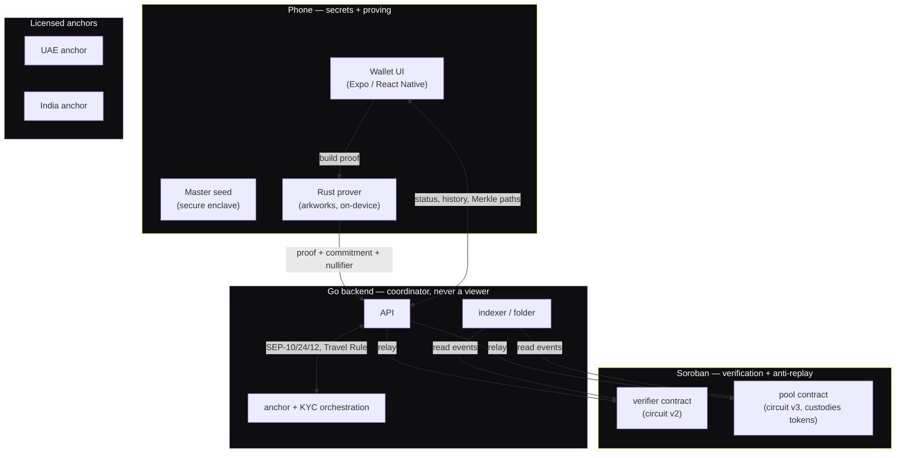

**The rule that makes this work:** secrets and proving live **on the phone**. Verification and
anti-replay live **on Soroban**. Orchestration, anchors, Travel Rule, and history live **in the Go
backend** — which never sees an amount or a raw identity either. It's a coordinator, not a viewer.

## How a transfer actually works

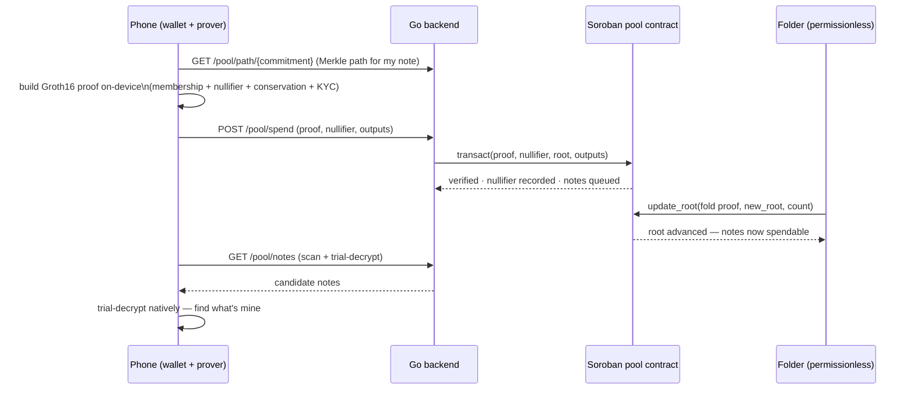

1. **Sign up** — the app generates a master seed on-device (secure enclave), creates a backend
   account keyed by email, and signs in with an emailed one-time code.
2. **Verify once (KYC)** — identity documents go from the phone to the verification provider,
   never through Prova's servers. On approval, the anchor signs a credential the phone stores and
   never uploads anywhere.
3. **Add money** — deposit into the shielded pool via a real anchor rail (SEP-24) or, in dev, a
   simulated instant credit.
4. **Send** — the phone selects a note, fetches its Merkle membership path, and generates a Groth16
   proof **on-device**: ownership, a fresh nullifier, value conservation across two outputs, and a
   valid KYC credential — all without revealing the amount to anyone, including Prova's own servers.
5. **Submit** — the proof goes to the Soroban pool contract (directly, or relayed by the backend).
   One BLS12-381 pairing check, replay rejection, and the new notes are queued.
6. **Fold** — a permissionless off-chain folder batches queued notes into the Merkle tree with its
   own proof, making them spendable.
7. **Payout + Travel Rule** — for a cash-out, the two anchors exchange the required data as a
   sealed, encrypted envelope decryptable only by the receiving anchor, never on-chain.
8. **History** — the backend's indexer reads on-chain events to build a private history the wallet
   can display; nothing PII- or amount-bearing is ever stored server-side.

## Testing

| Component                              | What's covered                                                                                                                                                                                                                                                                                                                       |
| -------------------------------------- | ------------------------------------------------------------------------------------------------------------------------------------------------------------------------------------------------------------------------------------------------------------------------------------------------------------------------------------ |
| `circuits/prover`                      | ~45 black-box shield/spend/fold integration tests where the must-fail cases _are_ the point — every assertion maps to a way money could be stolen, minted, or lost. Plus unit tests per circuit (v2 transfer, KYC credential, FFI round-trips).                                                                                      |
| `contracts/pool`, `contracts/verifier` | Contract tests build **real Groth16 proofs** via `prova-prover` as a dev-dependency rather than replaying fixtures, so a circuit/contract disagreement fails a contract test, not just a circuit test. Includes an executable CPU-cost gate proving the on-chain-hashing constraint (`gate_onchain_merkle_does_not_fit_cpu_budget`). |
| `backend`                              | Unit + handler tests for OTP (rate limiting, hashing, expiry), the SMTP mailer, rate limiting, KYC provider parsing, pool events, the folder, the prover shell-out, and pool spend handlers.                                                                                                                                         |
| `mobile`                               | `tsc --noEmit`, `expo lint`, Prettier — enforced in CI; validation logic mirrors and is tested against the same cases as the backend's Go validators.                                                                                                                                                                                |
| `shared`                               | `validation_test.go` and `validation.test.ts` assert the **same** cases on both sides of the TS/Go mirror.                                                                                                                                                                                                                           |

Run everything locally: see each component's own README for the exact commands
(`cargo test`, `go test ./...`, `npm run typecheck && npm run lint && npm run format:check`).

## Repository layout

A single git repository, one folder per component, each with its own toolchain, tests, and CI
workflow. Every component below has its own detailed `README.md` — this file is the map, not the
whole manual.

| Folder                     | Stack                    | What it is                                                                                                                                                 |
| -------------------------- | ------------------------ | ---------------------------------------------------------------------------------------------------------------------------------------------------------- |
| [`mobile/`](mobile/)       | React Native + Expo (TS) | The consumer app: wallet, KYC, send flow, cloud backup, the native ZK prover bridge                                                                        |
| [`backend/`](backend/)     | Go                       | API, sign-in, SEP/anchor orchestration, KYC state machine, the shielded pool's off-chain half (indexer + folder + relayer)                                 |
| [`contracts/`](contracts/) | Rust + Soroban           | Two on-chain programs: the per-transfer verifier and the shielded pool (real token custody)                                                                |
| [`circuits/`](circuits/)   | Rust + arkworks          | The ZK circuits (BLS12-381 Groth16) and the on-device prover, shared by mobile, backend, and contracts                                                     |
| [`shared/`](shared/)       | TypeScript + Go          | Cross-component schemas — proof format, IVMS101, API types, error codes, the pool/note format, the legal text — mirrored, not generated, in both languages |
| [`web/`](web/)             | Next.js (TS)             | The public site and, at `/ops`, the operator console: KYC review queue and support inbox                                                                   |

### Full file structure

```
Prova/
├── mobile/                          Expo app (React Native, TypeScript)
│   ├── src/
│   │   ├── app/                     expo-router screens (sign-in, KYC, send, deposit, settings, …)
│   │   ├── features/                tab implementations (home, activity, profile, KYC identity step)
│   │   ├── components/              design-system primitives + app-level components
│   │   ├── lib/                     keys, vault, pool, prover bridge, API client, validation, …
│   │   ├── hooks/, constants/, config/
│   ├── modules/prova-prover/        Expo native module → JNI → the Rust prover
│   └── assets/                      brand images, fonts, icons
│
├── backend/                         Go API service
│   ├── cmd/api/                     entrypoint (RUN_MODE selects API / indexer / both)
│   ├── cmd/verifyproof/             dev CLI: submit a proof, print accept/reject
│   ├── internal/
│   │   ├── server/                  HTTP router + every handler
│   │   ├── transfers/, chain/, indexer/, anchor/     legacy per-transfer relay + Soroban + SEP rails
│   │   ├── pool/                    the shielded pool's off-chain half (service, indexer, folder, relayer)
│   │   ├── kyc/, otp/, mailer/, ratelimit/           identity, sign-in, and abuse controls
│   │   ├── store/                   Postgres persistence (PII-free, amount-free)
│   │   └── config/
│   └── migrations/                  versioned SQL, embedded + boot-applied
│
├── contracts/                       Soroban (Rust) — Cargo workspace
│   ├── verifier/                    circuit-v2 per-transfer proof verifier
│   ├── pool/                        circuit-v3 shielded pool (token custody, notes, Merkle root)
│   ├── scripts/                     deploy_testnet.sh, deploy_pool_testnet.sh
│   └── DEPLOYMENTS.md               live contract IDs, tx hashes, verification checks
│
├── circuits/
│   └── prover/                      the real crate — everything else in circuits/ is a retired
│       ├── src/lib.rs                Circom/BN254 prototype
│       ├── src/credential.rs         KYC credential: anchor-signed Jubjub EdDSA
│       ├── src/pool/                 shield / spend / fold circuits + Merkle tree + note encryption
│       ├── src/ffi.rs, jni_bridge.rs  the mobile native-module bridge
│       └── src/bin/prova_prover.rs   the CLI: setup, proving, artifact generation, dev tools
│
├── shared/                          cross-component schemas (mirrored, not generated)
│   ├── src/                         TypeScript — consumed by mobile/ and web/
│   │   └── legal.ts                 Privacy Policy + Terms, so app and site publish one wording
│   └── go/schema/                   Go — consumed by backend/
│
├── web/                             Next.js — marketing site + operator console
│   └── src/
│       ├── app/                     public pages (/, /privacy, /terms) and /ops (staff only)
│       ├── components/              site chrome, scroll reveal, shared legal renderer
│       └── lib/                     server-only session + backend client (COMPLIANCE_TOKEN never
│                                    reaches the browser)
│
├── Docs/                            product, architecture, and phase-by-phase design docs
├── .github/workflows/               one path-filtered CI workflow per component
└── README.md                        this file
```

## Prerequisites

| Tool                 | Version                                      | Used by                                               |
| -------------------- | -------------------------------------------- | ----------------------------------------------------- |
| Node                 | 22 LTS (`nvm use 22`)                        | mobile, shared                                        |
| Go                   | ≥ 1.25                                       | backend                                               |
| Rust + wasm32 target | stable (see `contracts/rust-toolchain.toml`) | contracts, circuits                                   |
| Stellar CLI          | ≥ 27                                         | contracts (deploy), circuits (dev tools)              |
| Docker + Compose     | recent                                       | backend (Postgres + Redis)                            |
| Expo dev client      | —                                            | mobile (Expo Go cannot load the native prover module) |

## Getting started

Build order matters: `shared` and `circuits/prover` are dependencies of the others.

```bash
# 1. shared — build first; mobile and backend both depend on it
cd shared && npm install && npm run build
cd shared/go && go build ./...

# 2. circuits — build the prover; backend and contracts both depend on the binary/artifacts it produces
cd circuits/prover && cargo build --release

# 3. contracts — optional unless you're redeploying or changing contract code
cd contracts && cargo test && stellar contract build --optimize

# 4. backend
cd backend
cp .env.example .env                          # see .env.example for LOCAL DEV vs PRODUCTION values
docker compose up -d postgres redis
set -a && source .env && set +a               # bare `go run` does NOT auto-load .env
go run ./cmd/api
curl localhost:8080/healthz

# 5. mobile — needs a development build, not Expo Go (the native prover module won't load in Expo Go)
cd mobile
nvm use 22 && npm install
cp .env.example .env
npm start
```

Deploying the contracts to testnet yourself, generating keys, and understanding which secret goes
where (and which one never touches a server at all) is a full step-by-step in
[`Docs/deployment-and-keys.md`](Docs/deployment-and-keys.md) — read §1 first, since two of Prova's
keys are far more dangerous than the rest and the difference isn't obvious from their names.

## Environment configuration

Every component ships a `.env.example` labeled by **LOCAL DEV** vs **PRODUCTION** value, so there's
one place to look, not a scavenger hunt across scripts:

| Component  | File           | Notable values                                                                                                                                                    |
| ---------- | -------------- | ----------------------------------------------------------------------------------------------------------------------------------------------------------------- |
| `backend/` | `.env.example` | `DATABASE_URL`, `REDIS_URL`, `POOL_CONTRACT_ID`, `CONTRACT_ID`, `RELAYER_KEY`, `ANCHOR_SEED`, `SMTP_*` (Gmail App Password compatible), `AUTH_MODE`               |
| `mobile/`  | `.env.example` | `EXPO_PUBLIC_API_BASE_URL`, `EXPO_PUBLIC_STELLAR_NETWORK`, `EXPO_PUBLIC_AUTH_MODE`, `EXPO_PUBLIC_DEPOSIT_MODE`, `EXPO_PUBLIC_GOOGLE_WEB_CLIENT_ID` (cloud backup) |
| `web/`     | `.env.example` | `PROVA_API_URL`, `OPS_PASSWORD`, `OPS_SESSION_SECRET`, `COMPLIANCE_TOKEN` (must equal the backend's) — the marketing pages need none of these                     |

No secret is ever required to run the app locally — `AUTH_MODE=development` accepts a fixed dev OTP
and `DEPOSIT_MODE=simulated` credits a local counter with no chain or anchor involved. The one key
that must **never** appear in any `.env` file, on any server, or in git is the pool admin secret —
see the danger-ranked key table in [`Docs/deployment-and-keys.md`](Docs/deployment-and-keys.md) §1.

## Security & privacy model

| Layer                  | Sees amounts?                       | Sees identity?                      | Holds custody?                                |
| ---------------------- | ----------------------------------- | ----------------------------------- | --------------------------------------------- |
| Phone (secure enclave) | Yes — that's where it's computed    | Yes — that's where credentials live | No — never on-chain balances of its own       |
| Soroban contracts      | No — only commitments/nullifiers    | No                                  | Yes — the pool contract custodies real tokens |
| Go backend             | No                                  | No — only an opaque `userId` hash   | No                                            |
| Licensed anchors       | Only their own leg (deposit/payout) | Yes — that's their regulatory role  | Only during on/off-ramp                       |

If you take one thing from this table: **the backend is the least trusted-with-secrets component in
the whole system, on purpose.** It coordinates a lot and stores none of what would matter if it were
breached.

**Concretely, on the code level:**

- The master seed and every key derived from it never leave `expo-secure-store` (iOS Keychain /
  Android Keystore) in the clear.
- Postgres holds commitments, nullifiers, status, and timestamps — never an amount, never a name.
- The KYC pipeline carries no PII across the wire it doesn't have to: documents go device → provider
  directly; the backend only ever sees an opaque `userId = Poseidon(secret, domain)`.
- The pool admin key — the one secret that can replace contract code — is never written to a
  `.env`, a server, or git; only its public address is. See the full danger-ranked key table in
  `Docs/deployment-and-keys.md` §1.
- Every unauthenticated endpoint (there's no session before sign-in) sits behind rate limiting, so a
  script can't burn an SMS/email budget or brute-force a six-digit code.

## Troubleshooting

| Symptom                                       | Likely cause                                                                                                                                        |
| --------------------------------------------- | --------------------------------------------------------------------------------------------------------------------------------------------------- |
| `go run ./cmd/api` ignores your `.env` values | Bare `go run` does **not** auto-load `.env` — `source .env` (with `set -a`/`set +a`) first, or use `docker compose up` which loads it automatically |
| Postgres/Redis connection refused             | Check for a port collision with another local project; `docker-compose.override.yml` supports `POSTGRES_PORT`/`REDIS_PORT` overrides                |
| Every fold rejected                           | `POOL_SETUP_SEED` doesn't match the seed the contract's embedded verifying keys were built with                                                     |
| Every spend rejected                          | KYC credential bound to an old identity — re-verify                                                                                                 |
| `queueDepth` climbing and not draining        | The folder has stalled, or its relayer key is unfunded — no funds at risk, but nothing new becomes spendable until it resumes                       |
| `/pool/*` returns 503                         | `POOL_CONTRACT_ID` is unset, or Postgres is unreachable                                                                                             |
| Mobile app can't find the native prover       | You're running Expo Go — the prover is a native module; use a development build (`eas build --profile development`)                                 |
| `initialize` fails on the pool contract       | Already initialized — it's one-shot; redeploy under a new contract ID if the admin address was wrong                                                |

The full, longer list (with exact commands) lives in
[`Docs/deployment-and-keys.md`](Docs/deployment-and-keys.md) §9.

## Documentation map

`Docs/` is the authoritative source for anything architectural — this repo's standing rule is to
read it before starting any non-trivial change, since Prova is a multi-repo system where the
circuit, contract, backend, and app must agree on shared formats.

| Doc                                                         | Covers                                                                                     |
| ----------------------------------------------------------- | ------------------------------------------------------------------------------------------ |
| [`proposal .md`](Docs/proposal%20.md)                       | The product case: the problem, the persona, why ZK + Stellar, why it's defensible          |
| [`tech-stack.md`](Docs/tech-stack.md)                       | Stack choices and why, the polyrepo split, the end-to-end technical workflow               |
| [`implementation-guide.md`](Docs/implementation-guide.md)   | The phase-by-phase build plan and exit criteria — the roadmap below is generated from this |
| [`shielded-pool.md`](Docs/shielded-pool.md)                 | The note/UTXO design, the Merkle-fold architecture, the full must-not-break invariant list |
| [`kyc-verification.md`](Docs/kyc-verification.md)           | The verification state machine, credential issuance rules, tiers                           |
| [`deposit-flow.md`](Docs/deposit-flow.md)                   | How money enters a Prova wallet (simulated vs. real anchor rails)                          |
| [`account-recovery.md`](Docs/account-recovery.md)           | Cloud backup, envelope encryption, the restore flow                                        |
| [`signup-and-validation.md`](Docs/signup-and-validation.md) | Sign-up, field validation (client + server), rate limiting, email delivery                 |
| [`deployment-and-keys.md`](Docs/deployment-and-keys.md)     | Every key, what it can do, where it goes, step-by-step contract deployment                 |
| [`environments.md`](Docs/environments.md)                   | Environment matrix and secrets handling                                                    |
| [`design-system.md`](Docs/design-system.md)                 | The UI style guide — dark theme, chartreuse accent, rounded glassy fintech look            |
| [`branding-assets.md`](Docs/branding-assets.md)             | Every brand/marketing image, spec, and generation prompt                                   |

## CI

All workflows live in [`.github/workflows/`](.github/workflows/) and are **path-filtered** — each
runs only when something it actually depends on changes.

| Workflow           | Runs on changes to                        | Checks                            |
| ------------------ | ----------------------------------------- | --------------------------------- |
| `web-ci.yml`       | `web/`, `shared/src/`                     | typecheck, Prettier, `next build` |
| `mobile-ci.yml`    | `mobile/`, `shared/src/`                  | typecheck, `expo lint`, Prettier  |
| `shared-ci.yml`    | `shared/src/`                             | typecheck, build                  |
| `backend-ci.yml`   | `backend/`, `shared/go/`                  | `gofmt`, `go vet`, build, tests   |
| `contracts-ci.yml` | `contracts/`, `circuits/`                 | fmt, clippy, wasm build, tests    |
| `circuits-ci.yml`  | `circuits/`                               | fmt, clippy, tests                |
| `docker-ci.yml`    | `backend/`, `shared/go/`, `.dockerignore` | image build + compose validation  |

The filters follow the **real** dependency graph, not the folder names, because the two disagree in
three places:

- The Go backend consumes `shared/go` through a `replace` directive, so a change there compiles into
  it — `backend-ci` watches `shared/go/**` for that reason.
- `contracts/pool` builds real Groth16 proofs in its tests via `prova-prover` as a path
  dev-dependency, so `contracts-ci` watches `circuits/**`.
- The Node pipelines watch `shared/src/**` rather than all of `shared/**`, so a Go-only edit does not
  run the mobile and web jobs for nothing.

A web-only change therefore runs `web-ci` and nothing else.

## Roadmap

| Phase                  | Ships                                                               | Status                                                                                               |
| ---------------------- | ------------------------------------------------------------------- | ---------------------------------------------------------------------------------------------------- |
| 0 — Foundations        | 5-component scaffold, CI, environments, shared schemas              | Done                                                                                                 |
| 1 — Core ZK on testnet | A Groth16 proof verifies on Soroban                                 | Done — pivoted BN254→BLS12-381 after discovering Soroban has no BN254 host functions                 |
| 2 — Stellar rails      | Commitment/nullifier store, testnet anchor deposit flow             | Done                                                                                                 |
| 3 — KYC attestation    | In-circuit anchor-signed credential check                           | Done                                                                                                 |
| 4 — Mobile prover UX   | On-device proving, honest progress, the shielded pool               | Core done — on-device latency benchmarking on real low-end hardware is the one remaining manual step |
| 5 — Real corridor      | Licensed anchors, Travel Rule, public trusted-setup ceremony, audit | Not started                                                                                          |
| 6 — Extraordinary      | Selective disclosure, proof aggregation, compliance-proof-as-an-API | Not started                                                                                          |

Full detail, exit criteria, and risks per phase: [`Docs/implementation-guide.md`](Docs/implementation-guide.md).
